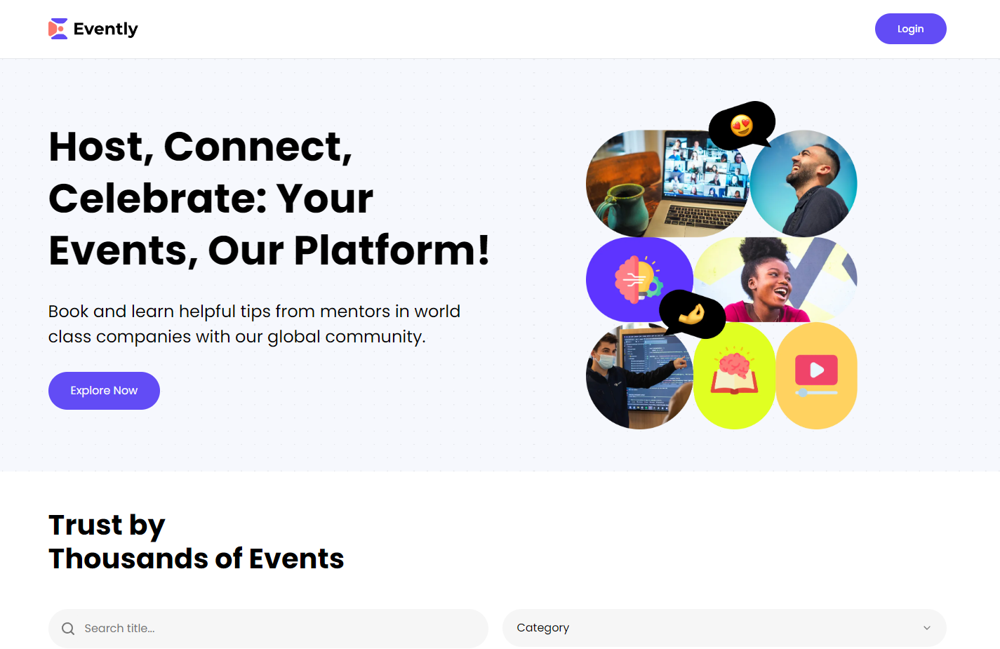

## Table of contents
* [General info](#general-info)
* [Technologies](#technologies)
* [Setup](#setup)
* [Demo](#demo)

## General info
This application is a Event Management app built using Next.js, radix-ui. 
Features: Host events, manage yours events, book tickets.


## Technologies
Project is created with:
* Next.js
* Clerk
* Uploadthing
* Stripe
* Radix UI
	
## Setup
To run this project locally:
```
$ npm install
$ npm run dev
```

Open http://localhost:3000 to view client in your browser.

## Demo
Vist [EventHub](https://event-hub-neon.vercel.app)